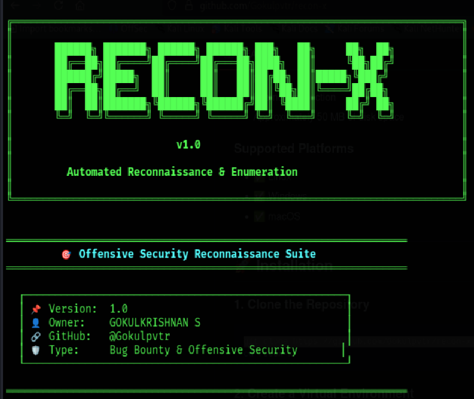

```markdown
# 🔍 RECON-X

### Automated Reconnaissance & Enumeration Tool

A Python-based reconnaissance tool for **subdomain discovery, live host detection, technology fingerprinting, and automated HTML reporting**.


---

## 📸 RECON-X in Action

<p align="center">
  
</p>

<p align="center">
  <i>RECON-X performing automated reconnaissance and enumeration.</i>
</p>

---

## 🎯 Overview

RECON-X automates common reconnaissance tasks used during authorized security assessments and bug bounty research.

Instead of manually performing multiple enumeration steps, RECON-X combines **subdomain discovery, HTTP/HTTPS probing, technology detection, and reporting** into a single workflow.

### ✨ Features

- 🔍 **Subdomain Enumeration** — Certificate Transparency, DNS brute-forcing, zone-transfer checks, and reverse DNS
- 🌐 **Live Host Detection** — HTTP/HTTPS probing with status codes and page titles
- 🛠️ **Technology Fingerprinting** — Detects servers, frameworks, CMS platforms, and technologies
- 📊 **HTML Reports** — Generates structured reconnaissance reports
- ⚡ **Multi-threaded Scanning** — Configurable threading for faster enumeration
- 📁 **JSON Export** — Saves structured results for further analysis or automation
- ⚙️ **Configurable Workflow** — Skip or enable individual reconnaissance phases
- 🎨 **Terminal Interface** — Dark security-focused CLI design

---

## 📋 Requirements

- Python 3.9+
- pip
- Internet connection
- Approximately 50 MB of disk space

### Supported Platforms

- ✅ Linux
- ✅ Windows
- ✅ macOS

---

## 🚀 Installation

### 1. Clone the Repository

```bash
git clone https://github.com/Gokulpvtr/recon-x.git
cd recon-x
```

### 2. Create a Virtual Environment

#### Windows

```bash
python -m venv venv
venv\Scripts\activate
```

#### Linux / macOS

```bash
python3 -m venv venv
source venv/bin/activate
```

### 3. Install Dependencies

```bash
pip install -r requirements.txt
```

---

## 💻 Usage

### Basic Reconnaissance

```bash
python -m src.main -d target.com
```

### Specify Threads

```bash
python -m src.main -d target.com -t 20
```

### Full Enumeration

```bash
python -m src.main -d target.com --full -t 25
```

### Skip Live Host Probing

```bash
python -m src.main -d target.com --no-probe
```

### Skip Technology Detection

```bash
python -m src.main -d target.com --no-detect
```

### Skip HTML Report Generation

```bash
python -m src.main -d target.com --no-report
```

> Replace `target.com` with a domain you own or are explicitly authorized to test.

---

## 🔎 Reconnaissance Workflow

```text
Target Domain
     │
     ▼
┌──────────────────────┐
│ Subdomain Discovery  │
└──────────┬───────────┘
           │
           ▼
┌──────────────────────┐
│ Live Host Detection  │
└──────────┬───────────┘
           │
           ▼
┌──────────────────────┐
│ Technology Detection │
└──────────┬───────────┘
           │
           ▼
┌──────────────────────┐
│ JSON + HTML Reports  │
└──────────────────────┘
```

---

## 🛠️ Enumeration Methods

RECON-X combines several reconnaissance techniques:

1. **Certificate Transparency** — Queries public certificate records through crt.sh
2. **DNS Brute-force** — Tests common subdomain names using a wordlist
3. **Zone Transfer Checks** — Tests DNS servers for AXFR availability
4. **Reverse DNS** — Performs PTR record lookups where applicable
5. **Live Probing** — Checks discovered hosts over HTTP and HTTPS
6. **Header Analysis** — Inspects HTTP response headers
7. **Content Analysis** — Attempts to identify frameworks, CMS platforms, and other technologies

---

## 📊 Output

Results are stored inside the `output/` directory.

```text
output/
├── target.com_subdomains.json
├── target.com_live_hosts.json
├── target.com_tech_detection.json
└── target.com_report.html
```

### Output Details

| File | Description |
|------|-------------|
| `*_subdomains.json` | Discovered subdomains |
| `*_live_hosts.json` | Reachable HTTP/HTTPS hosts |
| `*_tech_detection.json` | Detected technologies |
| `*_report.html` | Generated reconnaissance report |

Open the HTML file in your browser to view the complete report.

---

## ⚙️ Configuration

RECON-X can be customized through `config.yaml`.

```yaml
target_domain: "example.com"
threads: 10
timeout: 5
output_dir: "output"
screenshot: false
full_enum: false
```

### Configuration Options

| Option | Description |
|--------|-------------|
| `target_domain` | Domain to enumerate |
| `threads` | Number of parallel worker threads |
| `timeout` | Network request timeout |
| `output_dir` | Directory used for generated results |
| `screenshot` | Screenshot functionality |
| `full_enum` | Enables full enumeration mode |

---

## 📁 Project Structure

```text
recon-x/
├── src/
│   ├── __init__.py
│   ├── main.py
│   ├── enumerator.py
│   ├── prober.py
│   ├── detector.py
│   └── reporter.py
│
├── assets/
│   └── recon-x.png
│
├── wordlists/
│   └── subdomains.txt
│
├── output/
├── config.yaml
├── requirements.txt
├── README.md
├── TESTING.md
├── LICENSE
└── .gitignore
```

### Core Components

- `main.py` — CLI entry point and workflow controller
- `enumerator.py` — Subdomain discovery
- `prober.py` — HTTP/HTTPS live-host probing
- `detector.py` — Technology fingerprinting
- `reporter.py` — HTML report generation

---

## 🐛 Troubleshooting

### No Subdomains Found

Check that:

- The domain is correct
- Your internet connection is working
- DNS resolution is available

You can also try:

```bash
python -m src.main -d target.com --no-dns
```

### ModuleNotFoundError: No module named 'src'

Make sure you are running RECON-X from the repository root:

```bash
cd recon-x
python -m src.main -d target.com
```

### Slow Enumeration

Increase the number of threads:

```bash
python -m src.main -d target.com -t 25
```

Use higher thread counts responsibly to avoid excessive requests.

### crt.sh Errors

If Certificate Transparency queries fail, RECON-X can continue using other configured enumeration methods.

### Output Permission Errors

Make sure your user account has permission to write to the `output/` directory.

---

## ⚠️ Responsible Use

RECON-X is intended for:

- Authorized penetration testing
- Bug bounty programs
- Security research
- Educational environments
- Systems and domains you own

Only scan systems for which you have **explicit authorization**.

Always follow the target organization's security policy, bug bounty scope, rate limits, and applicable laws.

The author is not responsible for misuse of this tool.

---

## 🤝 Contributing

Contributions and suggestions are welcome.

To contribute:

1. Fork the repository
2. Create a new branch
3. Make your changes
4. Test the changes
5. Submit a pull request

You can also open an issue to report bugs or suggest improvements.

---

## 📚 Learning Resources

- [PortSwigger Web Security Academy](https://portswigger.net/web-security)
- [OWASP Web Security Testing Guide](https://owasp.org/www-project-web-security-testing-guide/)
- [HackerOne Hacktivity](https://hackerone.com/hacktivity)
- [Bugcrowd](https://www.bugcrowd.com/)

---

## 🧠 Skills Demonstrated

RECON-X demonstrates practical experience with:

- Python
- Networking
- DNS enumeration
- HTTP/HTTPS
- Reconnaissance automation
- Multi-threading
- JSON data processing
- HTML report generation
- CLI development
- Git & GitHub

---

## 🗺️ Future Improvements

Potential improvements for future versions include:

- Screenshot capture
- Additional passive reconnaissance sources
- Improved technology fingerprinting
- Custom wordlist support
- Extended report customization
- Additional export formats

---

## 📄 License

This project is licensed under the **MIT License**.

See the `LICENSE` file for details.

---

## 👤 Author

**Gokulkrishnan S**

- GitHub: [@Gokulpvtr](https://github.com/Gokulpvtr)
- Focus: Offensive Security, Web Application Security & Bug Bounty
- Education: Final-year BCA student

---

## ⭐ Support RECON-X

If you find RECON-X useful:

- ⭐ Star the repository
- 🐛 Report bugs
- 💡 Suggest improvements
- 🔀 Contribute through pull requests

---

<p align="center">
  <b>RECON-X</b><br>
  Automated Reconnaissance & Enumeration
</p>
```
